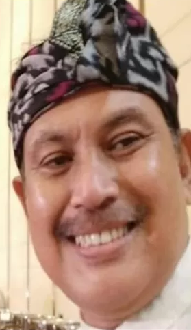

<!DOCTYPE html>
<html lang="id">

<head>
    <meta charset="UTF-8">
    <meta name="viewport" content="width=device-width, initial-scale=1.0">
    <title>Profil — Dimas Supriyanto</title>
    <link rel="stylesheet" href="assets/css/style.css">
</head>

<body>

    <header class="navbar">
        
dimas.my.id

        <nav>
            <a href="index.html">Beranda</a>
            <a href="articles.html">Artikel</a>
            <a href="about.html" class="active">Profil</a>
            <a href="portfolio.html">Portofolio</a>
            <a href="training.html">Pelatihan</a>
            <a href="contributors.html">Kontributor</a>
        </nav>
    </header>

    <section class="page-header">
        <h1>Profil Dimas Supriyanto</h1>
        
Wartawan senior dengan pengalaman lebih dari dua dekade di dunia jurnalisme.

    </section>

    <section class="content-container">
        

        <h2>Biografi Singkat</h2>
        
Pak Dimas adalah wartawan senior yang telah berkecimpung di dunia jurnalistik lebih dari 20 tahun. Beliau
            telah meliput isu sosial, hukum, politik, hingga kemanusiaan, serta dikenal dengan gaya penulisan yang lugas
            dan berwawasan.

        <h2>Karier</h2>
        <ul>
            <li>Reporter lapangan — 2001–2005</li>
            <li>Jurnalis investigasi — 2006–2012</li>
            <li>Redaktur — 2013–2019</li>
            <li>Wartawan senior & mentor jurnalistik — 2020–Sekarang</li>
        </ul>

        <h2>Keahlian</h2>
        <ul>
            <li>Penulisan berita</li>
            <li>Opini dan esai</li>
            <li>Investigasi jurnalistik</li>
            <li>Editing dan penyuntingan naskah</li>
            <li>Pelatihan jurnalistik untuk pelajar dan umum</li>
        </ul>
    </section>

    <footer>
        
© 2025 dimas.my.id — Dibangun oleh Ted.

    </footer>

</body>

</html>
