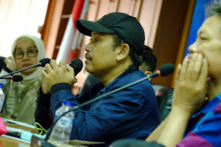

<!DOCTYPE html>
<html lang="id">

<head>
    <meta charset="UTF-8">
    <meta name="viewport" content="width=device-width, initial-scale=1.0">
    <title>Portofolio — Pak Dimas</title>
    <link rel="stylesheet" href="assets/css/style.css">
</head>

<body>

    <header class="navbar">
        
dimas.my.id

        <nav>
            <a href="index.html">Beranda</a>
            <a href="articles.html">Artikel</a>
            <a href="about.html">Profil</a>
            <a href="portfolio.html" class="active">Portofolio</a>
            <a href="training.html">Pelatihan</a>
            <a href="contributors.html">Kontributor</a>
        </nav>
    </header>

    <section class="page-header">
        <h1>Portofolio Liputan</h1>
        
Kumpulan karya, liputan, dokumentasi, dan pencapaian jurnalistik.

        
    </section>

    <section class="content-container portfolio-grid">

        

            <h3>Liputan Konflik Agraria</h3>
            
Feature mendalam tentang konflik tanah yang berdampak pada ribuan warga.

            

                
            

        

        

            <h3>Investigasi Korupsi Daerah</h3>
            
Laporan investigatif yang membawa perubahan kebijakan pemerintah daerah.

            

                
            

        

        

            <h3>Human Story: Penyintas Bencana</h3>
            
Kisah inspiratif dan humanis dari para penyintas bencana alam.

            

                
            

        

    </section>

    <footer>
        
© 2025 dimas.my.id — Dibangun oleh Ted.

    </footer>

    
</body>

</html>
